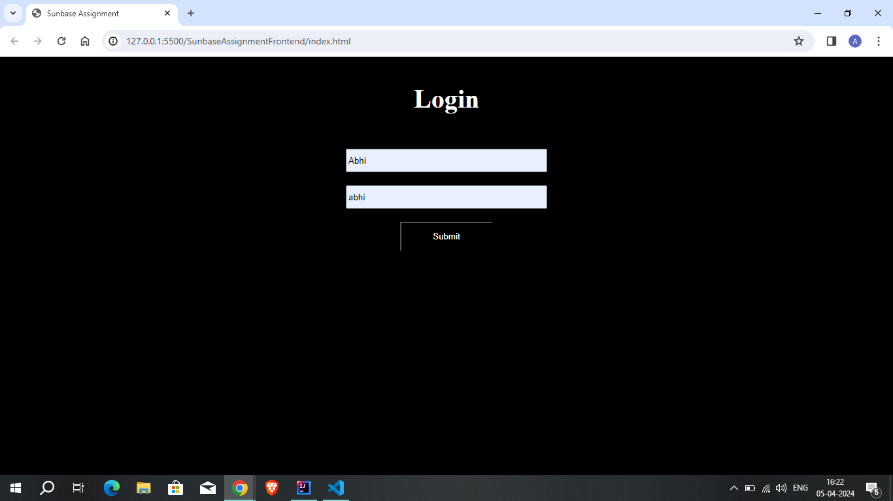

# Sunbase Assignment

Sunbase assignment Frontend Repository https://github.com/evoAB/SunbaseAssignmentFrontend

Sunbase assignment Backend Repository https://github.com/evoAB/SunbaseAssignment

<b>Tech Stack Used</b>
FrontEnd :- Html, css, Js
Backend :- Spring Boot, Java, JWT Authentication, SQL (Database: customerdb)

<b>Login page</b>

<b>Customer List</b>
.png)

<b>Add Customer</b>
.png)
.png)

<b>Search By phone</b>
.png)

<b>Sort By Email</b>
.png)

<b>Edit Customer</b>
.png)
.png)
.png)

<b>Sync</b>
.png)

# Getting Started
Clone the Repository Clone this repository to your local machine using the following HTTPS link:

git clone https://github.com/evoAB/SunbaseAssignment.git

# Open in IntelliJ
Open IntelliJ IDEA and follow these steps to clone the project:

Click on "File" in the top-left corner.

Select "New" and then click on "Project from Version Control."
Choose "Git" and paste the cloned repository URL.
Click "Clone" and wait for IntelliJ to download and set up the project.

# Set Up SQL Server
make sure to make <b>customerdb</b> named database in your database like MySQL

Also make necessay changes to application.properties according to your database like username and password for connecting to DB

# Start the Backend Server
Once you have completed the above steps:
Open the project in IntelliJ IDEA.
Right-click on the file and choose "Run SunbaseAssignmentApplication."

The backend server should start running, and you should see the application logs in the IntelliJ console.

# Getting Started with FrontEnd

How to Use

Clone this repository to your local machine using the following command:

git clone https://github.com/evoAB/SunbaseAssignmentFrontend

2) go to index.html page and open in live server , then login in with username and password given below .

# Log in using the following credentials:
   Username: Abhi
   Password: abhi